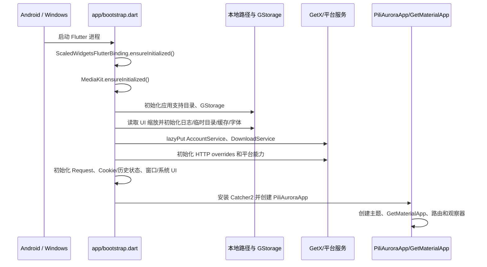

# PiliAurora 架构说明

> 供首次接手项目的开发者和 AI 代理查找代码入口。
>
> 本文按当前目录和实现整理。代码与配置发生变化时，以当前检出的仓库为准。

## 1. 项目定位

PiliAurora 是一个使用 Flutter/Dart 编写的 Bilibili 第三方客户端，当前维护目标是：

- Android；
- Windows x64。

应用在本地运行；仓库不包含配套的服务端。主要边界如下：

```text
用户
  │
  ▼
Flutter 应用（lib/）
  ├─ 页面与交互             lib/pages/
  ├─ GetX 路由              lib/router/
  ├─ Bilibili/第三方 API    lib/http/
  ├─ 跨页面和长生命周期能力  lib/services/
  ├─ 数据结构                lib/models/、lib/grpc/
  ├─ 播放器                  lib/plugin/pl_player/
  ├─ 通用组件和基础设施      lib/common/、lib/utils/
  └─ 平台入口                android/、windows/
       │
       ├─ Flutter 插件、JNI、Windows 原生能力
       └─ media_kit / mpv / WebView / 音频等平台库

外部边界：Bilibili API、直播/弹幕服务、SponsorBlock 等第三方网络服务
本地边界：应用支持目录、Hive 存储、缓存、下载文件、诊断日志
```

项目基于 PiliPlus 2.1.5 继续维护，重点包括 Windows 播放和弹幕、硬件解码兼容性、Android 播放恢复，以及性能、诊断和稳定性。

## 2. 当前已确认的技术基线

以下信息来自当前仓库的 `README.md`、`pubspec.yaml`、Android Gradle 文件和提交记录：

| 项目 | 当前事实 |
| --- | --- |
| Flutter | `3.47.5`，由 `.fvmrc` 固定 |
| Dart | SDK `>=3.13.0` |
| 应用版本 | `pubspec.yaml` 中为 `1.0.7+105` |
| 状态/路由 | 使用仓库 fork 的 GetX；路由集中在 `lib/router/app_pages.dart` |
| HTTP | Dio 及自定义初始化、重试、响应解码/转换代码 |
| 本地存储 | Hive CE 及项目自己的 `GStorage`、`Pref`、存储键定义 |
| 播放 | `media_kit`、`media_kit_video` 及项目的 `lib/plugin/pl_player/` 封装；部分依赖通过 `dependency_overrides` 指向 fork 或本地目录 |
| WebView | `flutter_inappwebview`；Windows 使用本地 `third_party/flutter_inappwebview_windows` override |
| 生成代码 | protobuf/gRPC 相关 Dart 代码在 `lib/grpc/`；Android JNI bindings 由 `tool/jnigen.dart` 生成 |
| 测试 | Flutter/Dart 测试在 `test/`，重点覆盖播放器、直播、下载、诊断、页面和账号等领域 |

依赖清理后，`pubspec.yaml` 已固定根依赖版本，定制源码由 `dependency_overrides` 指向仓库内的包。排查具体行为时，请同时核对来源登记和 `pubspec.lock`，不要套用 pub.dev 上同名包的默认实现。

## 3. 目录地图

```text
lib/
├─ main.dart                  仅调用 bootstrapApplication()
├─ app/                       启动装配、平台准备、根 Widget 与返回导航
├─ build_config.dart          构建时间、提交哈希等构建信息
├─ common/                    通用常量、主题样式、骨架屏、共享 Flutter 组件
├─ grpc/                      Bilibili gRPC/protobuf 生成代码及相关结构
├─ http/                      按业务域组织的 HTTP API 与网络横切逻辑
├─ models/                    页面/接口使用的数据模型、枚举和共享对象
├─ pages/                     页面功能；通常按功能域继续拆分 view/controller/widgets 等
├─ plugin/
│  └─ pl_player/              播放器控制器、播放模型、UI、弹幕、解码和全屏逻辑
├─ router/
│  └─ app_pages.dart          GetX 路由表，集中注册页面入口
├─ scripts/                   Flutter/Dart 源码补丁和相关脚本资源
├─ services/                  跨页面、长生命周期或后台能力
└─ utils/                     存储、缓存、路径、平台判断、扩展方法和业务辅助函数

仓库根目录：
├─ android/                   Android 工程、Gradle 配置和 JNI/Java 源码
├─ windows/                   Windows 工程和原生构建入口
├─ assets/                    图片、字体、直播资源、shader 等 Flutter 资源
├─ test/                      测试代码
├─ tool/                      构建、JNI 生成等开发工具
├─ third_party/               本地维护或替换的第三方插件实现
└─ doc/                       项目文档
```

### 3.1 `lib/http/`：远端 API 边界

API 文件包括 `video.dart`、`live.dart`、`login.dart`、`member.dart`、`dynamics.dart`、`fav.dart`、`follow.dart`、`msg.dart`、`search.dart`、`reply.dart`、`download.dart`、`danmaku.dart`、`sponsor_block.dart` 等。

网络横切逻辑主要位于：

- `init.dart`：请求层初始化入口；
- `retry_interceptor.dart`：重试相关逻辑；
- `response_decoder.dart`、`response_transformer.dart`：响应解码/转换；
- `validate.dart`、`error_msg.dart`：响应校验和错误处理；
- `constants.dart`、`api.dart`、`browser_ua.dart`：请求常量、接口辅助和 UA 相关定义。

页面可能直接调用 HTTP 层，也可能经由 service 或 controller 间接调用。项目没有强制所有请求都经过一个统一的 repository 层；修改前应沿 import 和实际调用关系确认。

### 3.2 `lib/models/`：数据模型，不等同于数据库实体

`models/` 同时承载：

- API JSON 的映射模型；
- 页面之间共享的对象；
- 枚举、设置值和播放器相关数据；
- `common/` 下的通用模型；
- `remote/` 下按远端业务组织的模型。

`lib/grpc/` 中包含生成的 gRPC/protobuf Dart 代码。除非任务明确是生成链路，否则不要直接修改生成文件；先定位源定义、生成脚本和调用方。Android JNI bindings 同样应优先通过 `tool/jnigen.dart` 重新生成，而不是手改 `bindings.g.dart`。

### 3.3 `lib/pages/`：按功能组织的页面

`pages/` 是最大的业务目录，包含首页、视频、番剧、直播、动态、搜索、用户空间、收藏、历史、稍后再看、消息、登录、设置、下载、WebView 等功能。典型目录可能包含：

```text
lib/pages/<功能域>/
├─ view.dart              页面入口
├─ controller.dart        页面状态和事件（不是每个目录都有）
├─ widgets/               只服务于该页面/功能域的组件（可选）
└─ ...                    子页面、模型或功能专属逻辑
```

页面常按这种方式组织，但没有统一的强制模板。状态管理、网络调用和生命周期处理需查看具体目录。

### 3.4 `lib/services/`：跨页面与长生命周期能力

顶层 service 文件包括账号、音频、日志、服务定位器和关闭定时器等；同时有以下功能子目录：

```text
lib/services/
├─ diagnostics/            诊断记录、历史读取、HTTP/播放器/进程指标、脱敏
├─ download/               任务调度、记录仓库、响应适配、流式写入
├─ live_stream/            直播包、解码器和直播传输逻辑
├─ account_service.dart    账号相关跨页面服务
├─ audio_handler.dart      音频后台/系统媒体控制相关能力
├─ audio_session.dart      音频会话
├─ logger.dart             日志入口
├─ service_locator.dart    平台服务定位/注册入口
└─ webview_environment.dart 共享 WebView 环境的所有者
```

不要把所有 controller 都称为 service。通常只有需要跨页面共享、后台持续运行、集中管理资源或连接平台能力的逻辑才应优先考虑放入 `services/`。

### 3.5 `lib/plugin/pl_player/`：播放器边界

播放器目录同时负责播放状态、原生输出和界面控制：

- `controller.dart`：播放控制和状态协调；
- `models/`：音量、倍速、全屏、硬解类型、播放状态、视频适配等模型；
- `utils/`：Android 解码恢复、解码回退、硬件视频配置、弹幕选项、预览图缓存、输出尺寸、全屏等；
- `view/`、`widgets/`：播放器界面和控制组件。

播放器问题应同时检查页面调用、播放器 controller、`media_kit` override、平台实现和诊断日志。不能只在 `pages/video/` 中寻找原因。

## 4. 启动链路：从 `main.dart` 开始

`lib/main.dart` 只调用 `app/bootstrap.dart` 的 `bootstrapApplication()`。启动装配与根 Widget 已分离；页面和底层模块不再导入入口文件。当前顺序如下：



### 4.1 已确认的启动步骤

1. 使用 `ScaledWidgetsFlutterBinding.ensureInitialized()` 初始化 Flutter，并使用 `MediaKit.ensureInitialized()` 初始化播放器基础设施。
2. 通过 `path_provider` 获取应用支持目录；初始化 `GStorage`。如果存储初始化失败，会记录错误、复制错误文本后退出进程。
3. 从 `Pref` 读取 UI 缩放，初始化日志，并并行准备下载路径、临时目录、缓存和字体。
4. 通过 GetX lazy 注册 `AccountService` 和 `DownloadService`；下载仓库及 HTTP/1.1 客户端在装配层显式注入。下载根目录通过回调读取，使设置更改能作用于后续扫描和新任务。
5. 安装全局 `HttpOverrides`；先初始化平台能力，再初始化 `Request`、Cookie 和历史状态同步，确保 Windows Cookie 使用已经创建的 WebView 环境。
6. 移动平台分支处理屏幕方向、Android 最大屏幕尺寸和服务定位器；Windows 分支尝试创建带应用支持目录的 WebView 环境。
7. 移动平台设置 edge-to-edge 系统 UI；Android 读取显示模式设置，桌面平台初始化窗口、最小窗口尺寸、标题栏、位置、最大化、显示和焦点。
8. 如果启用动态颜色，调用 `ThemeUtils.initPlatformState()`：优先读取系统核心调色板，失败后尝试读取 accent color，再失败则关闭动态颜色设置。
9. 初始化 `JsonFileHandler`，安装 `Catcher2`，向异常记录附加构建时间、提交哈希和 MPV API 版本等信息。
10. `PiliAuroraApp.build()` 创建 `GetMaterialApp`，挂载主题、本地化、初始路由 `/`、`Routes.getPages`、SmartDialog builder 和导航观察器。

### 4.2 启动时的安全注意

`_CustomHttpOverrides` 在调试模式，或 `Pref.badCertificateCallback` 被开启时，会接受无效证书。该开关会降低 TLS 校验强度，排查网络问题时要明确记录，发布环境不要把它当成常规解决方案。

### 4.3 职责与状态所有权

| 模块 | 职责 | 调用方 |
| --- | --- | --- |
| `app/bootstrap.dart` | 维护启动依赖顺序，装配下载仓库/客户端，挂载异常捕获与应用 | `main.dart` |
| `app/app_paths.dart` | 初始化支持、临时和下载目录；保留原路径回退规则 | 启动层 |
| `app/platform_setup.dart` | 音频/WebView/屏幕方向，以及窗口/系统 UI 初始化 | 启动层 |
| `app/app.dart` | 根 Widget、路由、主题、本地化、对话框与观察器 | 启动层 |
| `utils/theme_utils.dart` | 动态颜色读取和缓存、明暗主题生成与当前主题选择 | 根 Widget、设置页与主题更新扩展 |
| `services/webview_environment.dart` | WebView 环境唯一所有者；调用方只读 `instance` | 启动层初始化，WebView 页和 Cookie 同步读取 |
| `common/widgets/app_viewport.dart` | 注入缩放值后变换 MediaQuery；临时 padding 使用可独立释放的持有句柄 | 根 Widget、图片查看器 |

`ViewportInsets` 不主动触发重建：沿用系统 UI 变化导致的 MediaQuery 更新节奏。它保证先完成的异步操作不会清空另一个操作仍在使用的 padding。

## 5. 路由与页面入口

`lib/router/app_pages.dart` 通过 GetX 的 `GetPage` 集中注册路由。当前文件包含 **70 个 `GetPage` 声明**，包括根路由 `/`；根路由加载 `MainApp`。

主要入口类型包括：

| 功能 | 示例路由 |
| --- | --- |
| 主界面/内容 | `/`、`/home`、`/hot`、`/videoV` |
| 收藏/历史/稍后再看 | `/fav`、`/favDetail`、`/history`、`/later` |
| 搜索 | `/search`、`/searchResult`、`/searchTrending` |
| 动态/评论/消息 | `/dynamics`、`/dynamicDetail`、`/replyMe`、`/atMe`、`/whisper` |
| 直播 | `/liveRoom`、`/liveDmBlockPage` |
| 用户空间 | `/member`、`/memberSearch`、`/memberDynamics`、`/memberGuard` |
| 设置与诊断 | `/setting`、`/settingsSearch`、`/logs`、`/displayModeSetting` |
| 下载与外部能力 | `/download`、`/dlna`、`/webview` |
| 文章/音频/扩展 | `/articlePage`、`/articleList`、`/audio`、`/sponsorBlock` |

路由名使用字符串，不会随目录自动变化。新增或移动页面时，需要一起检查：

1. `app_pages.dart` 的 import 和 `GetPage` 注册；
2. 页面构造函数及其参数；
3. 页面内部 controller、数据请求和返回栈行为；
4. 相关测试和 deep link/外部打开逻辑（如果该功能支持）。

## 6. 依赖关系：维护视角与真实边界

推荐先使用下面的维护视角理解依赖方向：

```text
Flutter / Android / Windows
            │
            ▼
       main.dart → app/bootstrap.dart
            │
            ├─ 显式装配服务、平台准备、异常捕获 → app/app.dart
            ▼
         pages/ ───────────────► router/
            │
            ├───────────────► http/ ───────────────► Bilibili/第三方服务
            ├───────────────► services/ ───────────► 后台/跨页面能力
            ├───────────────► models/、grpc/
            ├───────────────► common/、utils/
            └───────────────► plugin/pl_player/ ────► media_kit/平台媒体库
```

项目没有用编译器强制这些边界，也没有完整实现 Clean Architecture。代码中仍有以下依赖关系：

- 页面 controller 直接调用 `lib/http/`；
- service 使用 HTTP、模型、存储和平台插件；
- `common/` 或 `utils/` 中的通用代码可能引用模型或平台判断；
- 播放器页面与播放器插件之间存在双向的状态/回调协作；
- 某些跨域功能横跨页面、HTTP、service、平台和测试多个目录。

因此，AI 或新人修改代码时应先从目标符号的 import、调用方和测试反向确认依赖，不要仅凭目录名称推断“只能单向依赖”。

### 6.1 已落实的依赖约束

`test/architecture/dependency_rules_test.dart` 检查以下规则（包含 package 和相对路径导入）：

- 不允许任何模块导入或导出 `main.dart`。
- `app/` 是最外层装配代码；除入口和 `app/` 内部外，其他 `lib/` 模块不得反向依赖它。
- 下载仓库不直接导入页面、Flutter Widget、GetX、网络、全局偏好或日志模块。
- 下载执行器必须接收 Dio，不能隐式读取 `Request` 客户端。

### 6.2 下载模块的接口

```text
app/bootstrap.dart
  └─ DownloadService(repository: ..., downloadClient: ...)
       ├─ DownloadRepository：扫描/创建/更新记录、媒体索引、删除任务或页面
       ├─ DownloadManager(client: ...)：执行单条音视频传输
       └─ 现有弹幕、封面缓存和播放地址接口
```

- `DownloadRepository` 集中维护 UGC/PGC 目录布局、`entry.json` 与 `index.json`；目录扫描结果不包含 GetX 队列副作用。坏记录单独跳过并通过回调报告。
- `save()` 在进入串行写队列前编码快照，防止并发写入互相截断、或后续模型修改污染之前的保存请求。它不是事务数据库，也不承诺进程崩溃时的原子写入。
- `DownloadService` 负责完成列表排序、待下载队列、任务状态和调度。重读目录替换队列快照，不重复追加；同一活动任务保留内存对象和下载进度。
- 没有新增仓库抽象接口或依赖注入框架：当前只有文件系统实现，构造函数注入已足够。测试直接使用临时目录，不需启动整个应用。
- 尚未重构的边界：下载模型仍带有页面展示辅助逻辑；下载服务仍协调 gRPC 弹幕、封面缓存和 UI 提示。这里落实的是启动层和持久化接口，不宣称整个项目已实现严格分层。

## 7. 数据、状态与本地文件

当前启动代码可以确认以下本地状态入口：

- `GStorage`：本地存储初始化和具体存储 box 的访问；
- `Pref`：对设置项的高层读取；
- `SettingBoxKey`：设置键定义；
- `CacheManager`：缓存初始化；
- `path_provider`：应用支持目录、临时目录和 Android 外部存储目录；
- `PathUtils`：应用目录/下载目录相关路径规则；
- `JsonFileHandler`：异常/诊断记录的文件处理；
- `LoggerUtils`、`logger`：结构化日志入口。

下载路径按平台处理：桌面优先使用设置中的自定义路径，否则使用默认路径；Android 使用 `getExternalStorageDirectory()` 下的项目下载目录；其他情况回退到默认路径。修改下载或设置功能时，不要只修改 UI：同时检查设置键、默认值、路径初始化、旧数据兼容和对应测试。

## 8. Android 与 JDK 25：当前构建事实

当前 Android 配置中可以直接确认：

- Gradle wrapper 为 `9.6.0`；
- Android Gradle Plugin 为 `9.2.1`；
- Kotlin 插件为 `2.4.20`；
- `android/gradle/gradle-daemon-jvm.properties` 设置 `toolchainVersion=25`，要求使用已安装的 JDK 25；
- CI 的 `actions/setup-java` 使用 Java 25；
- `android/app/build.gradle.kts` 的 Java `sourceCompatibility`、`targetCompatibility` 为 25；
- App Kotlin 使用 `jvmToolchain(25)`，`jvmTarget` 为 `JVM_25`；
- `android/build.gradle.kts` 对 Android 子项目统一设置 Java 25 toolchain、Java 编译目标和 Kotlin JVM target；
- App 的 `compileSdk` 和 `targetSdk` 当前为 37；
- Android Manifest 和样式文件新增了 `tools` 命名空间、`tools:targetApi` 标注以及特定 lint 忽略。

README 还明确说明：当前配置会把应用和 Android 子模块（包括 Flutter 插件源码）的 Java/Kotlin 编译目标及 Java 工具链统一到 25；Flutter SDK 内部构建逻辑和第三方预编译 JAR 保持其原始字节码版本。

这里需要区分三个概念：

```text
Gradle 运行时 JDK 25
        ≠ Android 设备运行时 API 25
        ≠ 所有输入 JAR/Flutter SDK 都必须是 Java 25 字节码
```

JDK 25 是构建工具链要求，不代表应用可以调用 Android API 25 的全部能力，也不代表可以随意改动 `minSdk`。`tools:targetApi` 主要是资源/lint 元数据，不是运行时兼容性证明。

## 9. 播放、直播、下载和诊断的横切关注点

这些领域跨越多个层次，排查时建议按下表展开：

| 问题 | 首先检查 | 然后检查 |
| --- | --- | --- |
| 视频无法播放/黑屏 | `lib/plugin/pl_player/controller.dart`、播放器 utils | `media_kit` override、Android/Windows 平台库、诊断日志 |
| Android MediaCodec 输出异常 | `lib/plugin/pl_player/utils/android_decode_recovery.dart`、播放器 controller | Android `AndroidHelper.java`、设备编解码器、回退测试 |
| Windows 硬解/AV1/帧节奏 | `pl_player` 的硬件配置、解码回退和输出尺寸逻辑 | Windows 本地媒体库、显卡驱动和媒体文件 |
| 弹幕卡顿/密度高时内存增长 | 弹幕模型、播放器弹幕选项和渲染 widgets | 缓存/预读、帧率、平台渲染差异 |
| 下载中断/恢复异常 | `services/download/`、响应适配、流式写入 | 路径权限、磁盘、网络重试和历史记录 |
| 直播包/聊天解析失败 | `services/live_stream/`、`lib/http/live.dart` | 压缩响应、WebSocket/TCP 数据和服务端变更 |
| 问题难以复现 | `services/diagnostics/`、`services/logger.dart` | 路由观察器、播放器指标、脱敏后的日志 |

README 已记录项目对 Android MediaCodec 输出异常恢复、Windows 硬件解码/弹幕路径、直播包和下载写入回压、结构化诊断等方向的改动。具体回退顺序仍以当前实现和测试为准。

## 阅读提示

本文提供目录和调用边界的导航。修改具体功能时，沿当前源码中的 import 和调用关系确认实现；构建与验证命令见 [构建与测试](build-and-test.md)。
