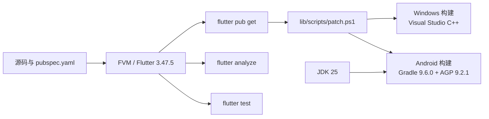

# 构建与测试

## 环境基线

- Flutter 版本由 `.fvmrc` 固定；当前 `pubspec.yaml` 声明 Flutter `3.47.5`、Dart `>=3.13.0`。
- Windows 构建需要 Visual Studio 的“使用 C++ 的桌面开发”。
- Android 构建需要 Android SDK 和 JDK 25；`JAVA_HOME` 与 Android Studio 的 Gradle JDK 应指向 JDK 25。
- 推荐 Windows 使用 PowerShell 7、Git、FVM。

## 构建工具链图



图中 Android 版本号来自当前 `android/` 配置；Windows 节点表示构建前提，不代表脚本会自动安装 Visual Studio。Android 工程还在 `android/gradle/gradle-daemon-jvm.properties` 中声明 Gradle 使用 JDK 25，并在应用和 Flutter 插件源码中统一 Java/Kotlin 编译目标为 25。

## 依赖与运行

```powershell
fvm install
fvm flutter pub get
fvm flutter analyze
fvm flutter test
```

如只验证某个目录，可传测试文件或目录给 `fvm flutter test`。测试按 common、grpc、http、pages、plugin、services、utils、windows 分组；播放器和平台测试可能依赖真实设备、驱动或媒体条件。

## 架构回归检查

```powershell
fvm flutter test --no-pub test/architecture test/services/download test/common/widgets/app_viewport_test.dart test/utils/theme_utils_test.dart
```

依赖约束测试防止底层代码反向导入入口或装配层。下载测试使用临时目录和假网络响应；主题测试使用临时 Hive 和模拟平台通道，不需要真实账号或业务网络。完成局部检查后再运行全量测试及静态分析。

## 项目构建脚本

仓库提供 `tool/build.ps1`，它会检查 Dart/FVM、执行 `flutter pub get`，按平台执行 `lib/scripts/patch.ps1`，最后调用 Flutter build：

```powershell
pwsh -File tool/build.ps1 -Platform windows -Mode debug
pwsh -File tool/build.ps1 -Platform android -Mode debug
pwsh -File tool/build.ps1 -Platform windows -Mode release
pwsh -File tool/build.ps1 -Platform android -Mode release
```

`-Mode` 还支持 `profile`；只有在明确理解影响时才使用 `-SkipPatch`。Android 构建脚本会使用仓库内 `.gradle-tmp` 作为临时目录（本机该目录也能规避默认临时目录中的 Java 本地 socket 连接失败，详见下节），并将简单的 HTTP/HTTPS 代理环境变量转换为 Java 代理参数。

## 故障记录：Gradle 的本地 socket 初始化失败

记录日期：2026-10-06。环境：Windows 11 10.0.26300.9550、Oracle JDK
25.0.3、Flutter 3.47.5、Gradle 9.6.0。

### 症状与定位

直接运行 `flutter build apk --debug --target-platform android-x64 --no-pub`
时，Gradle 尚未进入项目编译就失败：

```text
java.io.IOException: Unable to establish loopback connection
  sun.nio.ch.PipeImpl$Initializer.init
  sun.nio.ch.WEPollSelectorImpl.<init>
  java.nio.channels.Selector.open
Caused by: java.net.SocketException: Invalid argument: connect
  sun.nio.ch.UnixDomainSockets.connect0
```

**已确认的失败点**是 Java NIO Selector 为自身管道创建本地 Unix-domain socket
时，在本机默认用户临时目录中连接失败；不是 Dart/Android 源码编译错误。
用只调用 `Selector.open()` 的 Java 探针，不加载 Flutter 或 Gradle，也能复现。
单独改变 socket 临时目录为仓库 `.gradle-tmp` 后，探针成功。

| 对照 | 本机结果 |
| --- | --- |
| 默认用户临时目录（Windows 8.3 别名） | `Invalid argument: connect` |
| 同一目录完整拼写或新建子目录 | 同样失败 |
| 仓库内 `.gradle-tmp` | `SELECTOR_OK` |
| 仅把 `TEMP`、`TMP` 改为 `.gradle-tmp` | `SELECTOR_OK`，Android Debug 构建成功 |
| Gradle `--no-daemon` 加 IPv4 参数 | 仍失败 |
| JDK 17 对默认临时目录执行相同探针 | 同样失败；不能据此归因于 JDK 25 专有回归 |

失败路径比成功路径更短，两者所在卷均为 NTFS；目录检查未发现重解析链接。
因此不能把“路径太长”“8.3 别名”“普通 IPv4 环回网络”写成已确认根因。
探针复现了与目录有关的本地 socket 环境问题，但尚未确定底层 Windows
组件或安全软件成因；不据此修改防火墙、系统代理或全局 Java 配置。

### 修复与复验

优先使用项目已有脚本，它已为 Android 构建设置仓库内临时目录：

```powershell
pwsh -NoProfile -File tool/build.ps1 -Platform android -Mode debug
```

需要直接调用 Flutter 时，仅在当前 PowerShell 进程设置环境，不永久修改系统变量：

```powershell
$gradleTemp = Join-Path (Get-Location).Path '.gradle-tmp'
New-Item -ItemType Directory -Path $gradleTemp -Force | Out-Null
$env:TEMP = $gradleTemp
$env:TMP = $gradleTemp
flutter build apk --debug --target-platform android-x64 --no-pub
```

可在仓库 `build/` 目录保存以下 `SelectorProbe.java`，隔离验证目录差异：

```java
import java.nio.channels.Selector;
public class SelectorProbe {
    public static void main(String[] args) throws Exception {
        try (var selector = Selector.open()) {
            System.out.println("SELECTOR_OK");
        }
    }
}
```

先在默认环境运行 `java build/SelectorProbe.java`，再比较：

```powershell
java "-Djdk.net.unixdomain.tmpdir=$gradleTemp" build/SelectorProbe.java
```

本次修复后 Android x86_64 Debug APK 构建成功（最终版本 `1.0.6+91`），
播放器代码和测试的定向静态分析无问题，全仓 266 项测试通过。
第三方插件仍有 compileSdk 覆盖及 Kotlin Gradle Plugin 兼容提示，未通过升级依赖
或关闭检查掩盖它们。APK 构建不证明真实设备的 MediaCodec/GPU 播放效果。

遇到相同故障时，先用最小探针区分 Java 环境和项目代码，再只改变临时目录做对照。
相同堆栈重复出现时停止无证据重试；`--no-daemon` 仍可能创建单次 daemon，
也无法消除客户端自身的 Selector 初始化需求。

## 代码生成

```powershell
fvm dart run tool/jnigen.dart
```

生成的 JNI/protobuf 产物不要直接手工改；先修改源定义或生成脚本，再重新生成并检查 diff。

## 验证策略

| 改动 | 最小验证 |
| --- | --- |
| 页面/UI | 对应 `test/pages`，再 `fvm flutter analyze` |
| HTTP/模型 | `test/http` 与模型相关测试 |
| Service/下载/直播 | `test/services`，必要时补充生命周期/异常测试 |
| 播放器 | `test/plugin`，再用目标平台、编码、清晰度和弹幕密度实测 |
| Android/JNI | Android 构建及 `test/grpc`/相关单测 |
| Windows/窗口/WebView | Windows 构建和 `test/windows`；真实 WebView/显卡行为需设备验证 |

## 常见故障定位

- FVM 不可用：确认 `dart`、`fvm` 在 PATH，且版本与 `.fvmrc` 一致。
- 依赖获取失败：检查网络、代理、缓存和 `pubspec.lock`；不要未经授权升级生产依赖。
- Android 构建失败：检查 JDK 25、`JAVA_HOME`、Android SDK、Gradle 临时目录和 `lib/scripts/patch.ps1` 输出；当前工程使用 Gradle 9.6.0、AGP 9.2.1、Kotlin 2.4.20，Java/Kotlin 编译目标为 25。
- Windows 播放异常：区分构建失败、播放器初始化、硬件解码、渲染窗口和弹幕性能；参见 `doc/dev/`。
- 分析已有大量日志：以本次命令输出和改动相关诊断为准，不把历史 `*-log` 当作当前结果。

## 报告验证结果的格式

报告应列出执行的命令、开始和结束时间、目标平台、结果，以及失败原因和未验证的范围。没有运行的检查不要记为通过；测试和断言也不能为凑出通过结果而删减。

## 草稿验收后发布

正式版本使用合并到 main 的提交创建标签，再以标签运行现有双平台工作流。需要先核验全部产物时，显式传入 `draft_release=true`：

```powershell
gh workflow run build.yml --ref v1.0.7 -f tag=v1.0.7 -f build_android=true -f build_win_x64=true -f draft_release=true
```

该选项默认 false，原有自动发布方式不变。启用后，Android 和 Windows 会把产物上传到同一草稿。等两个平台的工作流都成功，再核对标签与构建提交，以及三个 Android ABI APK、Windows portable ZIP 和 setup 共五个附件；确认完整后再执行：

```powershell
gh release edit v1.0.7 --draft=false --latest
```

发布说明必须区分通道/单元回归、平台构建与实机播放验收；构建成功不能替代真实 GPU 像素回归。不将本机 Debug 包混入正式 Release，也不修改或覆盖历史发布资源。
