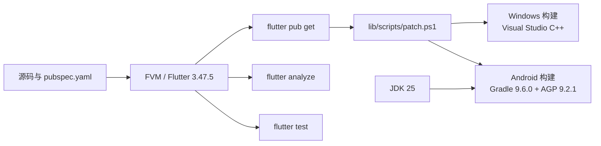

# 构建与测试

## 环境基线

- Flutter 版本由 `.fvmrc` 固定；当前 `pubspec.yaml` 声明 Flutter `3.47.5`、Dart `>=3.13.0`。
- Windows 构建需要 Visual Studio 的“使用 C++ 的桌面开发”。
- Android 构建需要 Android SDK 和 JDK 25；`JAVA_HOME` 与 Android Studio 的 Gradle JDK 应指向 JDK 25。
- 推荐 Windows 使用 PowerShell 7、Git、FVM。

## 构建工具链图



图中 Android 版本号来自当前 `android/` 配置；Windows 节点表示构建前提，不代表脚本会自动安装 Visual Studio。Android 工程还在 `android/gradle/gradle-daemon-jvm.properties` 中声明 Gradle 使用 JDK 25，并在应用和 Flutter 插件源码中统一 Java/Kotlin 编译目标为 25。

## 依赖与运行

```powershell
fvm install
fvm flutter pub get
fvm flutter analyze
fvm flutter test
```

如只验证某个目录，可传测试文件或目录给 `fvm flutter test`。测试按 common、grpc、http、pages、plugin、services、utils、windows 分组；播放器和平台测试可能依赖真实设备、驱动或媒体条件。

## 项目构建脚本

仓库提供 `tool/build.ps1`，它会检查 Dart/FVM、执行 `flutter pub get`，按平台执行 `lib/scripts/patch.ps1`，最后调用 Flutter build：

```powershell
pwsh -File tool/build.ps1 -Platform windows -Mode debug
pwsh -File tool/build.ps1 -Platform android -Mode debug
pwsh -File tool/build.ps1 -Platform windows -Mode release
pwsh -File tool/build.ps1 -Platform android -Mode release
```

`-Mode` 还支持 `profile`；只有在明确理解影响时才使用 `-SkipPatch`。Android 构建脚本会使用仓库内 `.gradle-tmp` 作为临时目录，并将简单的 HTTP/HTTPS 代理环境变量转换为 Java 代理参数。

## 代码生成

```powershell
fvm dart run tool/jnigen.dart
```

生成的 JNI/protobuf 产物不要直接手工改；先修改源定义或生成脚本，再重新生成并检查 diff。

## 验证策略

| 改动 | 最小验证 |
| --- | --- |
| 页面/UI | 对应 `test/pages`，再 `fvm flutter analyze` |
| HTTP/模型 | `test/http` 与模型相关测试 |
| Service/下载/直播 | `test/services`，必要时补充生命周期/异常测试 |
| 播放器 | `test/plugin`，再用目标平台、编码、清晰度和弹幕密度实测 |
| Android/JNI | Android 构建及 `test/grpc`/相关单测 |
| Windows/窗口/WebView | Windows 构建和 `test/windows`；真实 WebView/显卡行为需设备验证 |

## 常见故障定位

- FVM 不可用：确认 `dart`、`fvm` 在 PATH，且版本与 `.fvmrc` 一致。
- 依赖获取失败：检查网络、代理、缓存和 `pubspec.lock`；不要未经授权升级生产依赖。
- Android 构建失败：检查 JDK 25、`JAVA_HOME`、Android SDK、Gradle 临时目录和 `lib/scripts/patch.ps1` 输出；当前工程使用 Gradle 9.6.0、AGP 9.2.1、Kotlin 2.4.20，Java/Kotlin 编译目标为 25。
- Windows 播放异常：区分构建失败、播放器初始化、硬件解码、渲染窗口和弹幕性能；参见 `doc/dev/`。
- 分析已有大量日志：以本次命令输出和改动相关诊断为准，不把历史 `*-log` 当作当前结果。

## 报告验证结果的格式

说明实际执行的命令、开始/结束时间、目标平台、通过/失败、失败原因和未验证范围。不要把“命令未执行”写成“通过”，也不要通过删除测试或降低断言来制造绿色结果。
