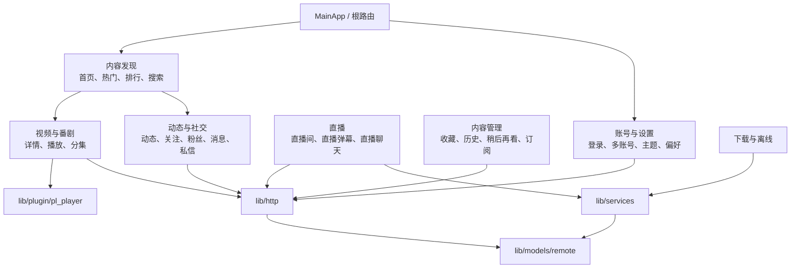

# 功能领域地图

项目有 400+ 页面和模型文件。按用户任务查找时，先定位所属领域的页面，再沿 API、模型和服务追踪调用链。

## 领域关系图

图中箭头表示“通常需要继续查阅”的关系，不表示所有页面都必须经过同一条调用链；具体行为以页面 import 和实际调用为准。
## 首页与内容发现

- 页面：`lib/pages/main/`、`home/`、`rcmd/`、`hot/`、`rank/`、`popular_*`、`search*`。
- API/模型：`lib/http/api.dart`、`search.dart`、`lib/models/remote/` 下的 `popular/`、`search/` 等。
- 入口：根路由 `/` → `MainApp`；具体子页见 `lib/router/app_pages.dart`。
- 风险：推荐/热门响应结构变化、分页和登录态差异；优先检查同域测试。

## 视频、文章、番剧与音频

- 页面：`lib/pages/video/`、`article/`、`article_list/`、`pgc/`、`audio/`、`music/`。
- API：`lib/http/video.dart`、`pgc.dart`、`music.dart`、`reply.dart`。
- 播放：`lib/plugin/pl_player/`；播放诊断见 `lib/services/diagnostics/player_diagnostics.dart`。
- 模型：`lib/models/remote/video/`、`pgc/` 及顶层视频模型。
- 修改顺序：先确认详情/播放地址/弹幕的资源标识（aid、bvid、cid），再改 UI。

## 弹幕与评论

- 页面：`lib/pages/danmaku/`、`danmaku_block/`、`main_reply/`、`my_reply/`。
- API/模型：`lib/http/danmaku.dart`、`reply.dart`，`lib/models/remote/danmaku/`、`reply/`。
- 渲染：通用组件和播放器插件；直播弹幕另走直播间链路。
- 风险：视频弹幕和直播消息采用不同的生命周期；修改渲染或消息队列时分别检查对应代码和回归测试。

## 直播

- 页面：`lib/pages/live/`、`live_room/`、`live_search/`、`live_follow/`、`live_dm_block/`。
- API：`lib/http/live.dart`。
- 服务：`lib/services/live_stream/live.dart`、`live_packet.dart`、`live_packet_decoder.dart`。
- 排障：分别检查连接、包解码、历史与未读消息、渲染和退出清理。

## 账号、登录与会员

- 页面：`login/`、`login_devices/`、`login_log/`、`member/`、`member_profile/` 等。
- API：`lib/http/login.dart`、`member.dart`、`user.dart`、`fan.dart`、`follow.dart`。
- 服务/本地状态：`lib/services/account_service.dart`、`lib/utils/accounts/`、`lib/utils/storage*`。
- 安全：严禁把 Cookie、Token、二维码登录信息或完整账号数据写入文档、日志和 issue。

## 动态、关注、粉丝与消息

- 页面：`dynamics*`、`follow*`、`fan/`、`msg_feed_top/`、`whisper*`。
- API：`lib/http/dynamics.dart`、`follow.dart`、`fan.dart`、`msg.dart`。
- 模型：`lib/models/remote/dynamic/`、`follow/`、`msg/`。
- 风险：互动操作通常依赖登录态和 CSRF/请求上下文，失败时不要只看页面 toast。

## 收藏、历史、稍后再看与订阅

- 页面：`fav*`、`history*`、`later*`、`subscription*`。
- API：`lib/http/fav.dart`、`lib/http/pgc.dart` 以及 `lib/models/remote/history/`、`later/` 等响应模型。
- 模型：`lib/models/remote/fav/`、`history/`、`later/`。
- 关注分页、排序、文件夹类型和 PGC/UGC 分支，避免复用错误的响应模型。

## 下载与离线文件

- 页面：`lib/pages/download/`。
- 服务：`lib/services/download/download_manager.dart`、`download_service.dart`、`download_repository.dart`、`response_adapter.dart`、`stream_writer.dart`。
- API/配置：`lib/http/download.dart`，下载路径初始化在 `lib/app/app_paths.dart`，设置键在 `lib/utils/storage_key.dart`。
- 排障：目录权限、磁盘空间、网络重试、流式写入回压和任务退出顺序。

## 设置、主题与本地能力

- 页面：`lib/pages/setting/`、`settings_search/`、`space_setting/`。
- 基础设施：`lib/common/style.dart`、`lib/utils/theme_utils.dart`、`storage_pref.dart`、`platform_utils.dart`。
- Windows 还涉及窗口管理、WebView、托盘和路径；Android 还涉及权限、屏幕方向、JNI。

## WebView、分享、DLNA 与第三方能力

- 页面：`webview/`、`share/`、`dlna/`、`sponsor_block/`、`bubble/`。
- 相关依赖和代码：`flutter_inappwebview`、`dlna_dart`、`share_plus` 等，具体调用从页面 import 反查。
- 这些功能通常有平台差异，新增逻辑应同时检查 Android/Windows 编译路径。

## 修改一个功能时

1. 在 `lib/router/app_pages.dart` 找到页面路由。
2. 找页面 `view.dart` 的状态持有者和事件处理。
3. 沿 import 找 `lib/http` 或 `lib/services`。
4. 确认响应模型和空值/分页/错误处理。
5. 查对应 `test/<domain>/`；必要时补回归测试。
6. 执行 `fvm flutter analyze` 与最相关测试，再按平台风险补充构建或实测。

